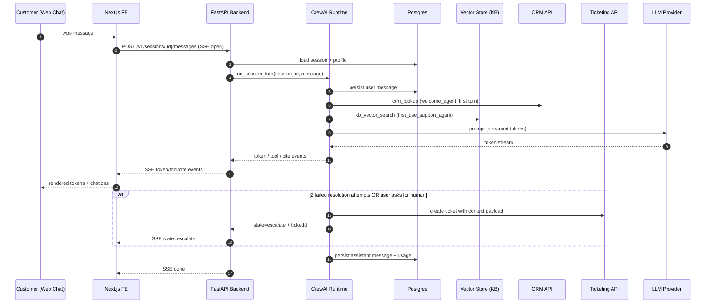

# System Architecture Document (SAD)
## Multi-Agent Customer Onboarding Crew — MVP

## Input Requirements

**PRD Document**: `project-context/1.define/prd.md` (v2026-08-18) — authoritative for scope.
**MRD**: N/A — intentionally skipped by the PRD (Section 1); internal MVP capstone, no commercial market case required.
**User Stories**: `project-context/1.define/user-stories/` — folder not populated; user stories captured inline in PRD Section 4 (F1–F5) and used as story anchors here.
**MVP Scope**: Core value proposition (80/20) — welcome/qualification → personalized plan → grounded first-use support → escalation with context; sponsor brief on request.
**Selected Runtime**: `crewai` (resolved via `aamad.config.example.yml` `runtime.target`; `AAMAD_TARGET_RUNTIME` env var unset — see Audit).

## System Architecture Specification

### 1. MVP Architecture Philosophy & Principles

**MVP Design Principles**

- Customer / operator feedback first: chat-first surface with a controlled beta cohort; observable session outcomes drive iteration.
- Minimal viable agent set (five, matching PRD F1–F5) with the simplest orchestration that still preserves context across the arc.
- Observable by default: structured per-turn logs, Prompt Trace and Trace Log persisted under `project-context/2.build/logs`, redacted for PII.
- Automated deploy scaffolding from day 1: CI (lint/test/build) + container-based deploy target defined in SAD, executed in Deliver.
- Reproducibility default: crew-level `memory=false`, sequential process, low temperature, YAML-first agent/task config per `adapter-crewai`.

**Core vs Future Features**

- **MVP (P0)**: Web chat panel (customer-facing) + sponsor brief email fallback, five-agent CrewAI crew (welcome/sponsor/plan/support/escalation), Postgres for profile+transcript, managed vector store for KB retrieval, ticketing integration for escalation, structured logging, single-region managed container deploy.
- **Future Work (P1–P2)**: proactive confusion detection from behavioral events, guided setup wizard with sandbox preview, multilingual beyond EN/PT-BR, native mobile surface, churn-risk prediction, auto-KB entry from resolved escalations, enterprise IAM/SSO federation, multi-region HA, auto-scaling, agent memory beyond MVP scope, analytics warehouse, behavioral event pipeline.
- **Explicit exclusions**: LLM fine-tuning, on-prem inference, non-managed vector store, custom RAG retrieval stack, agentic tool synthesis, cross-tenant analytics.

**Technical Architecture Decisions (ADR-style, short)**

- **ADR-001 Runtime = CrewAI (sequential)**. Rationale: PRD §3 fixes runtime; sequential mode maximizes reproducibility and matches adapter guidance; hierarchical deferred (no SAD justification for MVP). Consequence: routing branches must be expressed via `Task.context` and conditional task inputs, not by ad-hoc delegation.
- **ADR-002 Frontend = Next.js (App Router) + React + TypeScript + Tailwind**. Rationale: PRD requires a web chat panel with WCAG 2.1 AA, streaming responses, and PT-BR/EN i18n; Next.js App Router supports server-sent streaming, RSC boundaries, and easy accessibility tooling; no vendor UI library is mandated by PRD, so Tailwind + headless components are chosen for minimalism (aamad.config.example.yml `ui.visual_style: minimal`).
- **ADR-003 Chat transport = Server-Sent Events (SSE)**. Rationale: PRD requires ≤ 500ms to first token (p95); SSE is simpler than WebSockets for one-way streaming and integrates cleanly with the SSE envelope emitted by the backend adapter to CrewAI kickoff.
- **ADR-004 Storage = Managed Postgres (profile + sessions + transcripts) + managed vector store (KB)**. Rationale: PRD §3 storage requirements; retention 90d per LGPD/GDPR; minimal ops surface for MVP.
- **ADR-005 Memory posture = disabled at MVP**. Rationale: reproducibility per `adapter-crewai` and PRD §3; context is passed explicitly via profile object and `Task.context`. `CREWAI_STORAGE_DIR` remains unset. Revisit at P1 if grounded-answer rate degrades due to lack of session recall.
- **ADR-006 Delegation policy**. Only `welcome_agent` (routes to sponsor vs plan track) and `first_use_support_agent` (hands off to escalation) have `allow_delegation=true`; all others `false` (matches PRD §3). Delegation targets validated at kickoff.
- **ADR-007 LLM default = Anthropic Claude Sonnet-class (or provider equivalent)**. Rationale: grounding quality and cost/latency profile suitable for the ≤ 3s p95 turn target and ≥ 95% grounded-answer requirement; provider selectable via `LLM_PROVIDER`/`LLM_MODEL` env vars. Recorded as Open Question (PRD OQ-1).
- **ADR-008 Human-review gate for sponsor brief = default ON at MVP**. Rationale: PRD F5 AC is customer-visible content; adapter-crewai recommends `human_input=true` for high-risk outputs. Toggled by `SPONSOR_BRIEF_REQUIRE_REVIEW` env var; open until stakeholder confirms (PRD OQ-5).
- **ADR-009 Grounding guardrail**. `first_use_support_agent` uses `Task.guardrail` to reject responses without a KB citation; on failure, agent must refuse-and-escalate rather than answer (PRD §8 risk).
- **ADR-010 Tenant isolation at query time**. Every DB and vector query is scoped by `tenant_id` derived from SSO claims. No cross-tenant tools exposed. Confirmed at each Task boundary.

### 2. Multi-Agent System Specification

**Agent Architecture Requirements**

Five specialized agents (PRD §3, F1–F5). Although the template suggests 3–4 agents, the fifth is retained because escalation with full context is a distinct responsibility with distinct tools; consolidating it into `first_use_support_agent` would violate single-responsibility and blur the PRD F4 SLA.

| id | role | goal | tools (least privilege) | `max_iter` | `allow_delegation` | memory |
|---|---|---|---|---|---|---|
| `welcome_agent` | Onboarding Greeter & Qualifier | Identify persona, capture profile, route track | `crm_lookup`, `profile_writer` | 3 | true (→ `sponsor_brief_agent`, `onboarding_plan_agent`) | false |
| `sponsor_brief_agent` | Business Sponsor Liaison | Produce ≤1p value/timeline brief | `case_study_search`, `doc_generator` | 2 | false | false |
| `onboarding_plan_agent` | Onboarding Planner | Generate personalized first-week plan | `template_library`, `docs_search`, `plan_writer` | 4 | false | false |
| `first_use_support_agent` | First-Use Guide | Grounded in-app Q&A during first use | `docs_search`, `kb_vector_search`, `config_validator` | 5 | true (→ `escalation_agent`) | false |
| `escalation_agent` | Escalation Coordinator | Package context and create ticket | `ticket_api`, `context_packager` | 2 | false | false |

All agents: `max_retry_limit=2`, temperature ≤ 0.3 (grounded outputs), `max_execution_time` tuned per task (see §7). Crew-level: `process=sequential`, `memory=false`, `max_rpm` set (default 60, tunable), `allow_delegation` at agent-level only, no manager agent.

**Task / Turn Orchestration**

- **Dependencies (task graph)**: `welcome_task` → { `sponsor_brief_task` | `plan_task` } → `first_use_support_task` (loop within session) → `escalation_task` (invoked on 2 failed resolution attempts on same question or explicit user request).
- **Expected outputs**: JSON profile object from `welcome_task`; markdown brief from `sponsor_brief_task`; JSON plan (milestones[]) from `plan_task`; grounded answer + citations JSON from `first_use_support_task`; ticket-id + payload from `escalation_task`.
- **Context passing**: single canonical `CustomerProfile` object produced by `welcome_task` is passed via `Task.context` to every downstream task. Session transcript passed as a rolling window (last N turns; N configurable, default 8) — full transcript sent only to `escalation_task` (PRD OQ-6 pins the window default here).
- **Error handling / retries / cancellation**: `max_retry_limit=2` at task level; on exhaustion, the crew emits a structured error event and, if in support flow, invokes `escalation_task` automatically (PRD F4 AC1). Client cancellation of the chat stream aborts the current agent turn and marks the session state as `aborted`; no partial writes to persistent stores.
- **Performance budgets**: per-agent `max_execution_time`: welcome 5s, sponsor 12s, plan 15s, support 8s, escalation 20s. `max_iter` totals stay ≤ 12 per adapter baseline.

**Runtime-Conditional Configuration — crewai**

- **Crew composition**: five agents in `config/agents.yaml`; five tasks in `config/tasks.yaml`; wired by `crew.py`.
- **Process**: `sequential`. Hierarchical is not used; if introduced later, requires SAD update and Audit justification per adapter rules.
- **YAML externalization**: all agents, tasks, tool references, `max_iter`, `max_retry_limit`, `allow_delegation`, and `expected_output` live in YAML. Secrets loaded from env; tool references validated at kickoff.
- **Task context chaining**: explicit `Task.context: [<upstream_task_id>]` on every downstream task; no shared mutable state.
- **`expected_output`**: each task declares required headings/JSON shape and target artifact/response path where applicable, per adapter Quality Gates.
- **Guardrails**: `Task.guardrail` on `first_use_support_task` (must-include-citation) and `sponsor_brief_task` (size/format check); optional `human_input=true` on `sponsor_brief_task` gated by ADR-008.
- **Kickoff**: `crew.kickoff(inputs={...})` per session; `kickoff_for_each` not used (sessions are not batchable).

### 3. Frontend Architecture Specification

**Technology Stack**

- Framework: **Next.js 14+ (App Router)** with React Server Components where useful; TypeScript strict mode; Tailwind CSS for styling; headless UI primitives (Radix or shadcn/ui) — no vendor UI framework mandated.
- State: React state + URL state; server actions for auth-bound calls; SSE consumer for streaming chat.
- i18n: EN + PT-BR (PRD §2); `next-intl` or equivalent, defaulting to browser locale.
- Type safety: TypeScript strict; shared schema types generated from a single OpenAPI contract with the backend.

**Application Structure**

- Routes:
    - `/(app)/chat` — main chat panel (embedded chat surface; can also be mounted as an iframe/widget).
    - `/(app)/sponsor-brief/[sessionId]` — read-only sponsor brief view (email link target).
    - `/(auth)/callback` — SSO OAuth2 callback.
    - `/api/*` — Next.js route handlers act only as thin proxies to the backend API (no runtime invocation from FE per epic boundary).
- API client boundary: single typed client (`lib/api-client.ts`) hitting the backend chat + brief endpoints; **no CrewAI import in the frontend**.
- Components: `<ChatPanel>`, `<MessageList>`, `<Composer>`, `<Citation>`, `<TalkToHumanButton>` (always visible per PRD §6), `<SponsorBriefView>`, `<ErrorBanner>`, `<StreamStatus>`.
- Responsive & a11y: WCAG 2.1 AA, keyboard-navigable, ARIA-live for streamed tokens, 4.5:1 contrast; mobile-responsive but native mobile deferred.

**Interface Requirements**

- Primary surface: embedded chat panel with streaming assistant messages, citation chips, and a persistent "Talk to a human" affordance.
- Loading / error states: skeleton for initial session; typing indicator; explicit error banner with retry + escalate CTA on stream failure.
- Placeholders for Future Work: proactive nudge slot (P1 confusion detection), guided-setup wizard entry point.

### 4. Backend Architecture Specification

**API Architecture**

- Framework: **FastAPI** (Python 3.11+) — aligns with `aamad.config.example.yml language.primary: python` and CrewAI-native Python runtime.
- Endpoints (MVP):
    - `POST /v1/sessions` → creates a session; returns `sessionId`, initial profile stub.
    - `POST /v1/sessions/{id}/messages` (SSE stream) → user turn in; streams assistant tokens + tool events + citations out. Envelope below.
    - `POST /v1/sessions/{id}/escalate` → forces escalation path (manual "talk to a human").
    - `GET  /v1/sessions/{id}/brief` → retrieves/generates sponsor brief.
    - `GET  /healthz`, `GET /readyz` → liveness/readiness.
- Request schema (`POST .../messages`): `{ "message": string, "locale": "en"|"pt-BR", "clientMeta": {...} }`.
- SSE event envelope (each event on its own line, `event:` + `data:` JSON):
    - `event: token`   `data: { "text": string, "agent": string }`
    - `event: tool`    `data: { "name": string, "status": "start"|"end", "meta": {...} }`
    - `event: cite`    `data: { "sourceId": string, "url": string, "score": number }`
    - `event: state`   `data: { "phase": "welcome"|"plan"|"support"|"escalate"|"brief", "sessionState": {...} }`
    - `event: error`   `data: { "code": string, "message": string, "retryable": bool }`
    - `event: done`    `data: { "usage": {...}, "latencyMs": number }`
- Validation: Pydantic models on all inbound bodies; content length caps (message ≤ 4KB MVP).
- Rate limiting: per-tenant `max_rpm` at gateway; per-session token cap; 429 with `Retry-After` on breach.
- Error envelope (non-SSE): `{ "code": string, "message": string, "traceId": string }`.

**Data Architecture**

- **Postgres** (managed): tables `tenants`, `customers`, `sessions`, `messages`, `profiles`, `plans`, `escalations`. All queries scoped by `tenant_id`.
- **Vector store** (managed, e.g., pgvector on the same Postgres or Pinecone-class): KB embeddings; queried by `kb_vector_search`; ingest pipeline is deferred (KB assumed to exist per PRD Assumptions).
- Retention: 90 days for `messages`/transcripts (LGPD/GDPR); profiles retained for tenant lifetime; deletion-on-request supported via `DELETE /v1/customers/{id}` (deferred as admin surface — see Open Questions).

**Runtime Integration Layer**

- `crew.py` exposes a `run_session_turn(session_id, user_message)` coroutine invoked by the FastAPI SSE handler.
- Agent + task configs loaded from `config/agents.yaml` / `config/tasks.yaml` at process start; validated (tool bindings resolved) before serving traffic (`/readyz` fails until valid).
- Prompt Trace hook: rendered system + user prompts captured per task and written to `project-context/2.build/logs/prompt-trace-*.jsonl` (PII redacted).
- Trace Log hook: lifecycle events (task start/stop, retry, guardrail outcome, delegation) written to `project-context/2.build/logs/trace-*.jsonl`.
- Determinism: temperature ≤ 0.3, `max_tokens` per task, `max_iter` per agent, `max_rpm` at crew level.

**Authentication & Secrets**

- Customer surface: **OAuth2 SSO** (PRD §3). Internal service tokens via env vars.
- Env vars (names only, values in `.env`, `.env.example` published):
    - `LLM_PROVIDER`, `LLM_MODEL`, `LLM_API_KEY`
    - `DATABASE_URL`, `VECTOR_STORE_URL`, `VECTOR_STORE_API_KEY`
    - `CRM_BASE_URL`, `CRM_API_TOKEN`
    - `KB_SEARCH_URL`, `KB_SEARCH_TOKEN`
    - `TICKET_API_URL`, `TICKET_API_TOKEN`
    - `OAUTH_ISSUER_URL`, `OAUTH_CLIENT_ID`, `OAUTH_CLIENT_SECRET`
    - `SPONSOR_BRIEF_REQUIRE_REVIEW` (bool)
    - `CREWAI_STORAGE_DIR` (unset at MVP)
- No secret values in artifacts or committed config (per `aamad-core` security).

### 5. DevOps & Deployment Architecture

**CI/CD (MVP)**

- Pipeline stages: `lint` (ruff, eslint, prettier) → `test` (pytest, vitest) → `build` (Docker image build + push) → `deploy` (manual promotion in Deliver).
- Config generated as declarative files (e.g., `.github/workflows/ci.yml`) in Deliver phase; no live deploys triggered by AAMAD personas without operator authorization.

**Hosting**

- MVP target: single managed container service (e.g., AWS ECS Fargate / Fly.io / Cloud Run) — one region.
- Instances: 2 small backend containers behind a managed load balancer; 1 small frontend container (or Vercel deployment); managed Postgres; managed vector store.
- Health-check endpoints: `/healthz` (liveness), `/readyz` (readiness — includes YAML/tool validation).
- IaC, multi-region, blue/green: **Future Work** (documented, not built).

**Observability**

- Baseline: structured JSON logs (agent id, task id, tokens, latency, outcome), per-turn Trace Log, Prompt Trace, error tracker (e.g., Sentry) with PII scrubbing.
- Dashboards: escalation rate, grounded-answer rate, routing accuracy, cost per session, p95 turn latency.
- APM/distributed tracing: deferred to Future Work unless enterprise SLOs demand it.

### 6. Data Flow & Integration Architecture

**End-to-end request/response path (MVP)**



**External integrations (MVP only)**

- **CRM** (read-only): customer identity + subscription tier lookup by `welcome_agent`.
- **Knowledge Base** (vector search): grounded retrieval for `first_use_support_agent`.
- **Ticketing** (write): create ticket with packaged context (`escalation_agent`).
- **LLM Provider**: primary inference for all agents.
- **Email (sponsor fallback)**: transactional email for sponsor brief delivery link (managed provider; API-key-based).

**Error propagation**

- Tool error → task retries up to `max_retry_limit=2` → on exhaustion emit `event: error` with `retryable=false` and, in support flow, automatically transition to `escalation_task`.
- LLM outage → circuit-breaker at runtime integration layer; SSE emits state=escalate + user-visible "contact support" fallback (PRD §5).
- Guardrail failure (missing citation) → agent refuses and offers escalation instead of guessing.

### 7. Performance & Scalability Specifications

- Targets (PRD §5): first token ≤ 500ms p95; full agent turn ≤ 3s p95; escalation handoff ≤ 30s; 100 concurrent sessions MVP; 99.5% availability.
- Token/cost controls: temperature ≤ 0.3; `max_tokens` per task; `max_iter` per agent; rolling-window context (default 8 turns) except escalation; `max_rpm` at crew level; per-tenant rate limits at gateway.
- Latency budget (per turn, indicative): LLM 1500ms + KB retrieval 200ms + DB 100ms + orchestration 300ms + network 400ms = ~2.5s p95.
- Scaling path (deferred): horizontal auto-scaling of backend containers, read replica for Postgres, dedicated vector store instance — documented, not built for MVP.

### 8. Security & Compliance Architecture

- **AuthN**: OAuth2 SSO (PRD §3); PKCE for web client; short-lived access tokens; refresh flow via HTTP-only cookies.
- **AuthZ**: tenant scope enforced on every read/write; internal admin actions require RBAC role `onboarding_admin`. `escalation_agent` write to ticketing scoped by tenant.
- **Encryption**: TLS 1.2+ in transit; at-rest encryption on managed Postgres and vector store; secrets in a managed secret store.
- **PII handling**: redaction filter applied before Prompt Trace, Trace Log, error tracker events; profile fields marked sensitive are hashed in logs.
- **Least privilege tools**: agents bind only tools listed in §2 table; no shell, no arbitrary web fetch, no write-capable tools outside `profile_writer`, `plan_writer`, `doc_generator`, `ticket_api`, `context_packager`.
- **Compliance**: LGPD/GDPR — 90-day retention for transcripts; deletion-on-request supported (admin surface deferred but SQL path documented).
- **Security Assessment gate**: `security.md` from `@security.eng` REQUIRED before Deliver (`aamad.config.example.yml security.require_security_assessment: true`).

### 9. Testing & Quality Assurance Specifications

- **Unit tests** (pytest, vitest): per agent input/output schema, tool wrappers, profile object serialization, SSE envelope encoding.
- **Integration tests**: end-to-end task chain with mocked LLM+KB+CRM+ticketing; asserts `Task.context` continuity (no re-asking), guardrail behavior (citation required), escalation trigger conditions.
- **Smoke/acceptance**: scripted sessions covering PRD F1–F5 acceptance criteria (routing accuracy, ≤3s turn, grounded answers, escalation within 30s, sponsor brief ≤1p).
- **Runtime-specific checks** (CrewAI): YAML schema validation, tool-binding resolution on `/readyz`, `expected_output` heading/JSON contract validation, guardrail assertions.
- **Adversarial suite**: prompt injection, hallucination provocation, non-grounded question set; used to measure grounded-answer ≥ 95%.
- **Cost / latency** regression checks in CI where feasible (record-and-replay with fixture LLM responses).
- **Security assessment** (`@security.eng`) before Deliver; findings must be resolved or explicitly accepted.

### 10. MVP Launch & Feedback Strategy

- **Beta cohort**: 20 new signups with human coordinator on standby (PRD §9); explicit opt-in.
- **Success metrics** (PRD §7): time-to-first-successful-use ≤ 5d; setup completion ≥ 80%; ticket deflection −50%; grounded-answer ≥ 95%; escalation rate ≤ 15% at MVP.
- **Feedback loop**: onboarding CSAT survey at session end; human-handoff survey for escalations; weekly review of escalation rate + grounded-answer rate.
- **Iteration priorities post-launch**: tune retrieval quality; introduce proactive confusion detection (P1) if grounded rate stable; enable per-agent memory only after reproducibility risk is quantified.

## Logical Architecture (Views)

```mermaid
flowchart LR
    subgraph Client
        UI[Web Chat Panel<br/>Next.js + SSE]
    end
    subgraph Backend[Backend (FastAPI)]
        API[Chat API / SSE]
        RT[CrewAI Runtime Adapter<br/>crew.py + YAML]
    end
    subgraph Agents[CrewAI Agents (sequential)]
        WA[welcome_agent]
        SB[sponsor_brief_agent]
        OP[onboarding_plan_agent]
        FS[first_use_support_agent]
        ES[escalation_agent]
    end
    subgraph Data
        PG[(Postgres<br/>profiles/sessions/messages)]
        VS[(Vector Store / KB)]
    end
    subgraph External[External Systems]
        CRM[CRM API]
        LLM[LLM Provider]
        TK[Ticketing API]
        MAIL[Email Provider]
    end

    UI <-- SSE --> API
    API --> RT
    RT --> WA
    WA -->|Task.context| OP
    WA -->|Task.context| SB
    OP -->|Task.context| FS
    FS -->|delegate on failure| ES
    WA <--> CRM
    SB --> MAIL
    FS <--> VS
    ES --> TK
    WA & SB & OP & FS & ES --> LLM
    API <--> PG
    RT <--> PG
```

**Element catalog (primary)**

- **UI (Next.js)**: single chat surface; sponsor brief view; SSE consumer.
- **API (FastAPI)**: request validation, auth, SSE envelope, session persistence, invokes runtime adapter.
- **CrewAI Runtime Adapter**: loads YAML, validates tools, exposes `run_session_turn`, streams events.
- **Agents**: five roles per §2; each with least-privilege tool binding.
- **Postgres**: transactional store; tenant-scoped.
- **Vector store**: KB retrieval only (MVP).
- **External systems**: read (CRM, KB), write (ticket, email), inference (LLM).

## Physical / Deployment Architecture

```mermaid
flowchart TB
    subgraph DevEnv[Environment: dev]
        DevFE[FE container<br/>local / Vercel Preview]
        DevBE[BE container<br/>local docker-compose]
        DevPG[(Postgres local)]
        DevVS[(pgvector local)]
    end
    subgraph StageEnv[Environment: stage]
        StFE[FE container]
        StBE[BE containers x2]
        StPG[(Managed Postgres)]
        StVS[(Managed Vector Store)]
    end
    subgraph ProdEnv[Environment: prod (single region)]
        PLB[Managed Load Balancer]
        PFE[FE (managed CDN or container)]
        PBE1[BE container #1]
        PBE2[BE container #2]
        PPG[(Managed Postgres<br/>daily backups)]
        PVS[(Managed Vector Store)]
        SEC[Managed Secret Store]
        LOGS[Structured Logs + Error Tracker]
    end
    subgraph ExtProd[External (prod)]
        ELLM[LLM Provider API]
        ECRM[CRM API]
        ETK[Ticketing API]
        EMAIL[Email Provider]
        SSO[OAuth2 Identity Provider]
    end

    PFE <-- HTTPS/SSE --> PLB
    PLB --> PBE1
    PLB --> PBE2
    PBE1 <--> PPG
    PBE2 <--> PPG
    PBE1 <--> PVS
    PBE2 <--> PVS
    PBE1 & PBE2 --> ELLM
    PBE1 & PBE2 --> ECRM
    PBE1 & PBE2 --> ETK
    PBE1 & PBE2 --> EMAIL
    PFE --> SSO
    PBE1 & PBE2 --> SEC
    PBE1 & PBE2 --> LOGS
```

**Environments**

- `dev`: local docker-compose; no external LLM cost (fixture provider optional); memory disabled.
- `stage`: cloud-managed, single instance per component, restricted beta tenants.
- `prod`: single-region managed containers, managed Postgres (daily backups; RPO 24h / RTO 4h), managed vector store, managed secret store, CDN + LB for FE.

## Quality Attributes

| Attribute | Target (MVP) | Approach | Reference |
|---|---|---|---|
| Performance | first token ≤ 500ms p95; turn ≤ 3s p95 | SSE streaming; short prompts; low temperature; rolling context window | PRD §5, ADR-003 |
| Scalability | 100 concurrent sessions | Two BE instances + LB; horizontal scale-out documented | PRD §5, §7 |
| Reliability | 99.5%; graceful degradation on LLM outage | Circuit breaker → escalation path; `max_retry_limit=2` | PRD §5 |
| Observability | per-turn structured logs; escalation/grounding dashboards | Trace Log + Prompt Trace under `project-context/2.build/logs`; Sentry-class error tracker | adapter-crewai Logging |
| Security | SSO + tenant isolation + PII redaction | OAuth2 PKCE; tenant_id on every query; log scrubber; managed secret store | PRD §5, ADR-010 |
| Compliance | LGPD/GDPR; 90d retention; deletion-on-request | Retention job on `messages`; documented SQL delete path | PRD §5 |
| Cost | per-session cost within budget (TBD) | `max_iter`, `max_tokens`, context window caps, `max_rpm` | PRD §7 OQ-2 |
| Grounding | ≥ 95% grounded-answer rate | `Task.guardrail` requires citation; refuse-and-escalate | PRD §5, ADR-009 |

## Technical Constraints & Key Design Decisions (Summary)

- **Constraint**: CrewAI sequential process, YAML-first, `memory=false` (adapter + reproducibility).
- **Constraint**: Python primary backend; TypeScript frontend (aamad.config.example.yml language.primary + FE stack decision).
- **Constraint**: Security assessment required before Deliver.
- **Constraint**: No secrets in artifacts; env-var-only.
- **Decisions**: see ADR-001..010 in §1.

## Traceability

| PRD/MRD ID | Requirement / Story | SAD Section(s) | Decision(s) |
|---|---|---|---|
| PRD §3 Runtime | CrewAI sequential, YAML externalization, `memory=false` | §1 ADR-001, §2, §4 Runtime Integration | ADR-001, ADR-005 |
| PRD §3 Agents | Five specialized agents, tool bindings, delegation policy | §2 | ADR-006 |
| PRD §3 Integrations | CRM, KB, ticketing, LLM | §4 Auth/Secrets, §6 | ADR-004, ADR-007 |
| PRD §3 Infra | Single-region managed containers + Postgres + vector store | §5, Physical Arch | ADR-004 |
| PRD F1 Welcome & Qualification | `welcome_agent`; ≤5 turns; profile persisted | §2, §6 (sequence), §7 latency | ADR-006 |
| PRD F2 Personalized Plan | `onboarding_plan_agent`; plan from profile via `Task.context` | §2, §4 Data | — |
| PRD F3 First-Use Support | `first_use_support_agent`; grounded citations | §2, ADR-009 guardrail | ADR-009 |
| PRD F4 Escalation | `escalation_agent`; ticket + context; ≤30s | §2, §6, §7 | ADR-006 |
| PRD F5 Sponsor Brief | `sponsor_brief_agent`; ≤1p; on-request; review gate | §2, ADR-008 | ADR-008 |
| PRD §5 Performance | ≤500ms first token; ≤3s p95 turn | §7 | ADR-003 |
| PRD §5 Security | SSO, tenant isolation, PII, secrets, 90d retention | §8 | ADR-010 |
| PRD §5 Reliability | Circuit breaker; graceful degradation | §6 Error propagation, §7 | — |
| PRD §6 UX | Chat surface; accessibility; talk-to-a-human always visible | §3 | ADR-002 |
| PRD §7 KPIs | Routing accuracy, escalation rate, grounded-answer rate, CSAT | §9 Testing, §10 Feedback | ADR-009 |
| PRD §9 GTM | Controlled beta rollout | §10 | — |
| PRD Risk: Hallucination | Guardrail + refuse-and-escalate | ADR-009, §8, §9 | ADR-009 |
| PRD Risk: Context loss | Single profile object + `Task.context` chaining | §2 orchestration | ADR-005 |
| PRD Risk: Cost | `max_iter`, `max_rpm`, rolling context | §7 | — |
| aamad.config `security.require_security_assessment` | security.md before Deliver | §8, §9 | — |
| aamad.config `documentation.require_user_guide` | user-guide.md in Deliver | §10, Deliver plan | — |
| aamad.config `testing.require_unit_tests`/`_integration_tests` | Unit + integration MVP tests | §9 | — |

## Implementation Guidance for AI Development Agents

1. `@project.mgr` → `setup.md`: scaffold Python 3.11 backend (`config/agents.yaml`, `config/tasks.yaml`, `crew.py`, `pyproject.toml`), Next.js 14 frontend (App Router, TS strict, Tailwind), `.env.example`, docker-compose for dev.
2. `@frontend.eng` → `frontend.md`: implement chat panel + sponsor brief view + SSE consumer + i18n (EN/PT-BR) + WCAG 2.1 AA; **no backend wiring**.
3. `@backend.eng` → `backend.md`: implement CrewAI crew per YAML, FastAPI endpoints, SSE envelope, tool wrappers, guardrails, Prompt Trace/Trace Log hooks; enforce §2 controls.
4. `@integration.eng` → `integration.md`: wire FE ↔ BE via typed OpenAPI client; integrate CRM, KB vector search, ticketing, email; validate all tool bindings on `/readyz`.
5. `@qa.eng` → `qa.md`: unit + integration + smoke tests per §9; adversarial suite for grounding; performance regression checks.
6. `@security.eng` → `security.md`: pre-Deliver security assessment (SSO flow, PII redaction, secret handling, tenant isolation).
7. `@devops.eng` → `deploy.md`: CI (lint/test/build), single-region managed-container deploy, env matrix, rollback runbook; do not trigger live deploys without operator authorization.

## Architecture Validation Checklist

- [x] PRD requirements mapped to architectural components (see Traceability)
- [x] Agents designed for the domain and selected runtime (CrewAI sequential, YAML-first)
- [x] Frontend and backend contracts agree on schemas / streaming (SSE envelope in §4)
- [x] Secrets via env vars only (§4 Auth & Secrets)
- [x] MVP vs Future Work boundaries explicit (§1 Core vs Future)
- [x] Resolved `AAMAD_TARGET_RUNTIME` recorded in Audit
- [x] Human-review gate defined for high-risk outputs (ADR-008 sponsor brief)
- [x] Guardrails for grounded outputs (ADR-009)
- [x] Reproducibility posture explicit (`memory=false`, sequential, low temperature)

## Sources

- `project-context/1.define/prd.md` — authoritative scope, agents, NFRs, KPIs, risks (v2026-08-18).
- `.claude/rules/aamad-core.md` — universal principles, agent/task contracts, security policy.
- `.claude/rules/adapter-crewai.md` — CrewAI setup, mapping, execution controls, memory, logging, quality gates.
- `.claude/rules/adapter-registry.md` — runtime resolution rules.
- `.claude/rules/epics-index.md` — Build/Deliver epic mapping.
- `.claude/rules/development-workflow.md`, `.claude/rules/delivery-workflow.md` — phase gates.
- `.cursor/templates/sad-template.md` — this SAD's structural template.
- `aamad.config.example.yml` — resolved defaults (runtime target, security assessment requirement, documentation requirement, testing requirement).

## Assumptions

- **MRD is intentionally N/A** per PRD Section 1 (internal capstone MVP); market/pricing sections are out of scope.
- **`aamad.config.yml` is not present**; defaults resolved from `aamad.config.example.yml`. If an operator later adds `aamad.config.yml`, the runtime value and security/documentation/testing flags must be re-resolved and this SAD updated accordingly.
- **`AAMAD_TARGET_RUNTIME` env var is unset** at authoring time; runtime resolves to `crewai` from config. Operator override would take precedence per adapter-registry.
- **Frontend stack** (Next.js App Router + React + TS + Tailwind + headless UI) chosen because PRD does not mandate a vendor UI library and the template allows justified defaults; the aamad config `ui.visual_style: minimal` aligns with this choice.
- **LLM provider default** is Anthropic Claude Sonnet-class or provider equivalent; final choice deferred to PRD OQ-1 and captured under Open Questions.
- **KB corpus already exists** (PRD Assumption); ingestion pipeline is out of MVP scope.
- **Human support capacity** exists to absorb escalations during business hours (PRD Assumption).
- **Sequential CrewAI process** chosen; hierarchical/manager patterns explicitly deferred.
- **Rolling context window** default = last 8 turns; escalation task gets full transcript. Value is tunable via env var.
- **Sponsor brief human-review gate** defaults ON for MVP (safer for customer-facing content); disable requires stakeholder sign-off.
- **`allow_delegation=true`** limited to `welcome_agent` and `first_use_support_agent`; all others `false` (matches PRD §3 confirmation).

## Open Questions

1. LLM provider and model tier — cost/latency/grounding trade-off (PRD OQ-1 → `@system.arch` + stakeholder). Default assumed above but not committed.
2. Cost ceiling per onboarding session (PRD OQ-2 → stakeholder). Blocks final `max_iter`/`max_tokens` tuning.
3. Real baselines for time-to-value, setup completion, ticket mix (PRD OQ-3 → stakeholder/analytics). Blocks §7 KPI targets validation.
4. Escalation SLA — 24/5 vs 24/7 (PRD OQ-4 → Customer Success). Affects deployment readiness and Deliver runbook.
5. Sponsor brief human-review requirement (PRD OQ-5 → stakeholder). Currently ADR-008 defaults ON.
6. Session-context window size per agent turn (PRD OQ-6 → `@system.arch`). Currently 8 turns default; may need per-agent override.
7. Proactive confusion detection (P1) in/out for first release (PRD OQ-7 → PM). Requires behavioral event pipeline; currently deferred.
8. Enable agent memory at MVP? (PRD OQ-8 → `@system.arch`). Currently disabled; revisit at P1.
9. Admin surface for deletion-on-request (LGPD/GDPR) — dedicated UI vs CLI/DB job in MVP? (→ `@system.arch` + `@security.eng`).
10. Vector store choice — pgvector-on-Postgres vs dedicated managed service (Pinecone-class)? Affects cost and ops; defer to `@integration.eng` benchmarking.
11. i18n coverage on system-generated content (plan, brief) — do we translate LLM outputs, or prompt in target locale? (→ `@backend.eng`).
12. Frontend hosting — Vercel vs same container runtime as backend? Affects §5 topology (→ `@devops.eng`).

## Audit

- **Timestamp:** 2026-08-19T00:00:00Z
- **Persona id:** `@system.arch`
- **Action:** `*create-sad --mvp`
- **Resolved `AAMAD_TARGET_RUNTIME`:** `crewai` (env var unset; resolved from `aamad.config.example.yml runtime.target`; no `aamad.config.yml` present)
- **Adapter rules applied:** `.claude/rules/adapter-crewai.md`
- **Core rules applied:** `.claude/rules/aamad-core.md`, `.claude/rules/adapter-registry.md`, `.claude/rules/development-workflow.md`, `.claude/rules/delivery-workflow.md`, `.claude/rules/epics-index.md`
- **Template:** `.cursor/templates/sad-template.md` (v0.7.5 project family)
- **Artifact path:** `project-context/1.define/sad.md`
- **Write mode:** temp-write-then-atomic-replace (Windows/PowerShell)
- **Prompt Trace:** omitted at Define stage — deterministic template-driven authoring off PRD; low-risk Define artifact. Prompt Trace will be captured for production-facing Build/Deliver artifacts per `aamad-core` policy.
- **Next artifact:** `project-context/2.build/setup.md` by `@project.mgr`
