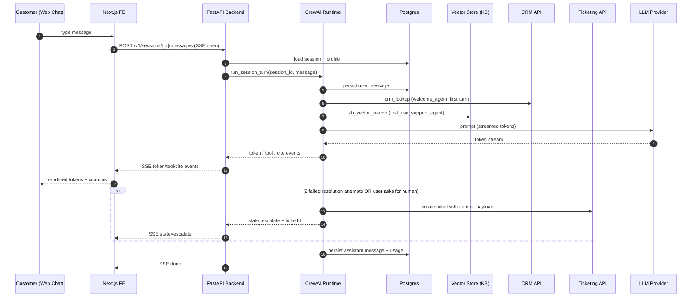

# System Architecture Document (SAD)
## Multi-Agent Customer Onboarding Crew — MVP

## Input Requirements

**PRD Document**: `project-context/1.define/prd.md` (v2026-08-23, incorporating ambiguity-handling update over v2026-08-18) — authoritative for scope.
**MRD**: N/A — intentionally skipped by the PRD (Section 1); internal MVP capstone, no commercial market case required.
**User Stories**: `project-context/1.define/user-stories/` — folder not populated; user stories captured inline in PRD Section 4 (F1–F6) and used as story anchors here.
**MVP Scope**: Core value proposition (80/20) — welcome/qualification → personalized plan → grounded first-use support → escalation with context; sponsor brief on request.
**Selected Runtime**: `crewai` (resolved via `aamad.config.example.yml` `runtime.target`; `AAMAD_TARGET_RUNTIME` env var unset — see Audit).

## System Architecture Specification

### 1. MVP Architecture Philosophy & Principles

**MVP Design Principles**

- Customer / operator feedback first: chat-first surface with a controlled beta cohort; observable session outcomes drive iteration.
- Minimal viable agent set (five, matching PRD F1–F5) with the simplest orchestration that still preserves context across the arc.
- Observable by default: structured per-turn logs, Prompt Trace and Trace Log persisted under `project-context/2.build/logs`, redacted for PII.
- Automated deploy scaffolding from day 1: CI (lint/test/build) + container-based deploy target defined in SAD, executed in Deliver.
- Reproducibility default: crew-level `memory=false`, sequential process, low temperature, YAML-first agent/task config per `adapter-crewai`.

**Core vs Future Features**

- **MVP (P0)**: Web chat panel (customer-facing) + sponsor brief email fallback, five-agent CrewAI crew (welcome/sponsor/plan/support/escalation), Postgres for profile+transcript, managed vector store for KB retrieval, ticketing integration for escalation, structured logging, single-region managed container deploy.
- **Future Work (P1–P2)**: proactive confusion detection from behavioral events, guided setup wizard with sandbox preview, multilingual beyond EN/PT-BR, native mobile surface, churn-risk prediction, auto-KB entry from resolved escalations, enterprise IAM/SSO federation, multi-region HA, auto-scaling, agent memory beyond MVP scope, analytics warehouse, behavioral event pipeline.
- **Explicit exclusions**: LLM fine-tuning, on-prem inference, non-managed vector store, custom RAG retrieval stack, agentic tool synthesis, cross-tenant analytics.

**Technical Architecture Decisions (ADR-style, short)**

- **ADR-001 Runtime = CrewAI (sequential)**. Rationale: PRD §3 fixes runtime; sequential mode maximizes reproducibility and matches adapter guidance; hierarchical deferred (no SAD justification for MVP). Consequence: routing branches must be expressed via `Task.context` and conditional task inputs, not by ad-hoc delegation.
- **ADR-002 Frontend = Web UI (Next.js App Router + React + TypeScript + Tailwind)**. Rationale: PRD §6 explicitly requires an **embedded chat panel in the web app** with WCAG 2.1 AA, streaming responses, and PT-BR/EN i18n — this rules out CLI as a primary surface for MVP. Next.js App Router supports server-sent streaming, RSC boundaries, and easy accessibility tooling; no vendor UI library is mandated by PRD, so Tailwind + headless components (Radix / shadcn/ui) are chosen for minimalism (aamad.config.example.yml `ui.visual_style: minimal`). **Considered alternatives**: (a) plain CLI — rejected: fails PRD §6 (chat panel embedded in web app) and WCAG requirements do not translate to CLI; kept as Future Work for internal ops tooling only; (b) SPA (Vite + React) — rejected: no first-class server streaming and RSC boundaries; would require re-implementing SSE plumbing already provided by Next.js route handlers.
- **ADR-003 Chat transport = Server-Sent Events (SSE)**. Rationale: PRD requires ≤ 500ms to first token (p95); SSE is simpler than WebSockets for one-way streaming and integrates cleanly with the SSE envelope emitted by the backend adapter to CrewAI kickoff.
- **ADR-004 Storage = Managed Postgres (profile + sessions + transcripts) + managed vector store (KB)**. Rationale: PRD §3 storage requirements; retention 90d per LGPD/GDPR; minimal ops surface for MVP.
- **ADR-005 Memory posture = disabled at MVP**. Rationale: reproducibility per `adapter-crewai` and PRD §3; context is passed explicitly via profile object and `Task.context`. `CREWAI_STORAGE_DIR` remains unset. Revisit at P1 if grounded-answer rate degrades due to lack of session recall.
- **ADR-006 Delegation policy**. Only `welcome_agent` (routes to sponsor vs plan track) and `first_use_support_agent` (hands off to escalation) have `allow_delegation=true`; all others `false` (matches PRD §3). Delegation targets validated at kickoff.
- **ADR-007 LLM default = Anthropic Claude Sonnet-class (or provider equivalent)**. Rationale: grounding quality and cost/latency profile suitable for the ≤ 3s p95 turn target and ≥ 95% grounded-answer requirement; provider selectable via `LLM_PROVIDER`/`LLM_MODEL` env vars. Recorded as Open Question (PRD OQ-1).
- **ADR-008 Human-review gate for sponsor brief = default ON at MVP**. Rationale: PRD F5 AC is customer-visible content; adapter-crewai recommends `human_input=true` for high-risk outputs. Toggled by `SPONSOR_BRIEF_REQUIRE_REVIEW` env var; open until stakeholder confirms (PRD OQ-5).
- **ADR-009 Grounding guardrail**. `first_use_support_agent` uses `Task.guardrail` to reject responses without a KB citation; on failure, agent must refuse-and-escalate rather than answer (PRD §8 risk).
- **ADR-010 Tenant isolation at query time**. Every DB and vector query is scoped by `tenant_id` derived from SSO claims. No cross-tenant tools exposed. Confirmed at each Task boundary.
- **ADR-011 Ambiguity handling contract (cross-cutting, maps PRD F6)**. Rationale: PRD F6 requires deterministic behavior when a user's work requirement is ambiguous — no silent guessing, bounded clarifications, structured fallback, and full traceability. This ADR fixes the operational contract for all agents.
    - **Operational definition of ambiguity (types a–e, per PRD F6):** (a) unclear user intent in welcome/qualify or first use; (b) conflicting signals across phases (qualify vs. first-use behavior); (c) insufficient grounding for `first_use_support_agent` (no KB source clears the threshold, or top KB matches tie within retrieval-score delta ≤ 0.1); (d) missing/contradictory fields in the `CustomerProfile` passed via `Task.context`; (e) partial match against escalation criteria. Each detection MUST tag `ambiguity_type ∈ {a,b,c,d,e}`.
    - **Confidence signal (decision).** MVP uses a **composite signal per agent**, computed as follows and consumed by `Task.guardrail`:
        - For `welcome_agent` (types a, d): self-critique score on slot completeness (0..1), threshold `< 0.7` triggers clarification.
        - For `first_use_support_agent` (type c): retrieval-based signal — top KB score `< 0.6` OR delta between top-1 and top-2 KB scores `≤ 0.1` triggers clarification.
        - For `escalation_agent` (type e): rule-based partial-match score against escalation policy.
        - Cross-phase conflict detection (type b) is deterministic (schema diff between profile at end of qualify vs. observed intent in first use).
        - Provider-native logprobs are **not** relied on at MVP (portability across LLM providers not guaranteed) — see OQ-10 for calibration path.
    - **Clarification cap `N=2` (decision).** Applied **per ambiguity instance, global across the session** (a re-attempt by a downstream agent does NOT reset the counter). The `ambiguity_flags[]` array on `CustomerProfile` is authoritative for attempt counts across agents (see §2). Alternative scoping — per-agent counter — is captured as OQ-11.
    - **Deterministic fallback via `template_library`.** The `template_library` tool exposes named defaults (`sponsor_brief_defaults.v1`, `first_week_plan_skeleton.v1`, and other curated entries). Selection order per PRD F6/AC3: (i) named default if a slot match exists → output labeled "based on standard defaults — pending confirmation"; (ii) otherwise, `escalation_agent` with a complete `ambiguity_report`. Curator/ownership of `template_library` is **not** decided in this SAD — see OQ-12.
    - **No-fabrication guardrail.** All ambiguity-affected tasks (`welcome_task`, `plan_task`, `first_use_support_task`, `sponsor_brief_task`) MUST attach `Task.guardrail` enforcing: (1) refusal to emit customer-specific facts when confidence is below the agent's threshold, (2) presence of citation for support answers, (3) presence of the `standard defaults` label when template fallback is used, and (4) hard stop after N=2 clarifications on the same instance. Guardrail failure → refuse + hand off to `escalation_task`.
    - **`ambiguity_report` emission.** When escalation is triggered by ambiguity, `context_packager` MUST emit a structured `ambiguity_report` (schema in §2) as part of the ticket payload. Reports are also written to the structured ambiguity log stream (§5).
    - **Transparency.** User-facing text always states why clarification is being asked and, on fallback, labels the output as either "based on standard defaults" or "connecting you with a human"; silent fallback is prohibited (PRD F6/AC7).
    - **Consequence.** This ADR binds §2 (contracts on tasks and `CustomerProfile`), §5 (observability schema), §8 (PII redaction on ambiguity events), and §9 (guardrail test suite). Trade-off: composite per-agent signals are more work than a single global signal, but avoid vendor lock-in on logprobs and remain portable across models — OQ-10 tracks calibration follow-up.

### 2. Multi-Agent System Specification

**Agent Architecture Requirements**

Five specialized agents (PRD §3, F1–F5). Although the template suggests 3–4 agents, the fifth is retained because escalation with full context is a distinct responsibility with distinct tools; consolidating it into `first_use_support_agent` would violate single-responsibility and blur the PRD F4 SLA.

| id | role | goal | tools (least privilege) | `max_iter` | `allow_delegation` | memory |
|---|---|---|---|---|---|---|
| `welcome_agent` | Onboarding Greeter & Qualifier | Identify persona, capture profile, route track | `crm_lookup`, `profile_writer` | 3 | true (→ `sponsor_brief_agent`, `onboarding_plan_agent`) | false |
| `sponsor_brief_agent` | Business Sponsor Liaison | Produce ≤1p value/timeline brief | `case_study_search`, `doc_generator` | 2 | false | false |
| `onboarding_plan_agent` | Onboarding Planner | Generate personalized first-week plan | `template_library`, `docs_search`, `plan_writer` | 4 | false | false |
| `first_use_support_agent` | First-Use Guide | Grounded in-app Q&A during first use | `docs_search`, `kb_vector_search`, `config_validator` | 5 | true (→ `escalation_agent`) | false |
| `escalation_agent` | Escalation Coordinator | Package context and create ticket | `ticket_api`, `context_packager` | 2 | false | false |

All agents: `max_retry_limit=2`, temperature ≤ 0.3 (grounded outputs), `max_execution_time` tuned per task (see §7). Crew-level: `process=sequential`, `memory=false`, `max_rpm` set (default 60, tunable), `allow_delegation` at agent-level only, no manager agent.

**Task / Turn Orchestration**

- **Dependencies (task graph)**: `welcome_task` → { `sponsor_brief_task` | `plan_task` } → `first_use_support_task` (loop within session) → `escalation_task` (invoked on 2 failed resolution attempts on same question or explicit user request).
- **Expected outputs**: JSON profile object from `welcome_task`; markdown brief from `sponsor_brief_task`; JSON plan (milestones[]) from `plan_task`; grounded answer + citations JSON from `first_use_support_task`; ticket-id + payload from `escalation_task`.
- **Context passing**: single canonical `CustomerProfile` object produced by `welcome_task` is passed via `Task.context` to every downstream task. Session transcript passed as a rolling window (last N turns; N configurable, default 8) — full transcript sent only to `escalation_task` (PRD OQ-6 pins the window default here).
- **Error handling / retries / cancellation**: `max_retry_limit=2` at task level; on exhaustion, the crew emits a structured error event and, if in support flow, invokes `escalation_task` automatically (PRD F4 AC1). Client cancellation of the chat stream aborts the current agent turn and marks the session state as `aborted`; no partial writes to persistent stores.
- **Performance budgets**: per-agent `max_execution_time`: welcome 5s, sponsor 12s, plan 15s, support 8s, escalation 20s. `max_iter` totals stay ≤ 12 per adapter baseline.

**Runtime-Conditional Configuration — crewai**

- **Crew composition**: five agents in `config/agents.yaml`; five tasks in `config/tasks.yaml`; wired by `crew.py`.
- **Process**: `sequential`. Hierarchical is not used; if introduced later, requires SAD update and Audit justification per adapter rules.
- **YAML externalization**: all agents, tasks, tool references, `max_iter`, `max_retry_limit`, `allow_delegation`, and `expected_output` live in YAML. Secrets loaded from env; tool references validated at kickoff.
- **Task context chaining**: explicit `Task.context: [<upstream_task_id>]` on every downstream task; no shared mutable state.
- **`expected_output`**: each task declares required headings/JSON shape and target artifact/response path where applicable, per adapter Quality Gates.
- **Guardrails**: `Task.guardrail` on `first_use_support_task` (must-include-citation) and `sponsor_brief_task` (size/format check); optional `human_input=true` on `sponsor_brief_task` gated by ADR-008. **Ambiguity guardrails** (per ADR-011) additionally attached to `welcome_task`, `plan_task`, `first_use_support_task`, and `sponsor_brief_task` — enforce (a) no customer-specific facts below confidence threshold, (b) citation-presence for support answers, (c) `standard defaults` labeling when template fallback applied, (d) hard stop after N=2 clarifications per instance, (e) presence of `ambiguity_report` when escalating on ambiguity.
- **Kickoff**: `crew.kickoff(inputs={...})` per session; `kickoff_for_each` not used (sessions are not batchable).

**Ambiguity Contracts (maps PRD F6, binds ADR-011)**

- **`CustomerProfile.ambiguity_flags[]` (task-context payload).** The single canonical `CustomerProfile` object produced by `welcome_task` and passed via `Task.context` MUST expose an `ambiguity_flags[]` array so downstream agents receive ambiguity context without re-detecting. Element schema:

```json
{
  "session_id": "string",
  "instance_id": "string",              // stable id for this ambiguity instance across agents
  "ambiguity_type": "a|b|c|d|e",        // per PRD F6 definition
  "affected_slot_or_intent": "string",  // e.g. "role", "primary_use_case", "kb_intent:reset_api_key"
  "confidence": 0.0,                    // agent-computed 0..1
  "clarification_attempts": 0,          // monotonic; hard-capped at 2 (ADR-011)
  "resolved": false,
  "fallback_applied": "none|template_default|escalation",
  "template_default_id": "string|null", // when fallback_applied == template_default
  "detected_by_agent": "string",
  "created_at": "ISO-8601"
}
```

- **`ambiguity_report` contract (escalation payload, produced by `context_packager`).** When `escalation_task` is triggered because of ambiguity (types a–e), the ticket payload MUST include an `ambiguity_report` object:

```json
{
  "session_id": "string",
  "instance_id": "string",
  "ambiguity_type": "a|b|c|d|e",
  "affected_slot_or_intent": "string",
  "confidence": 0.0,
  "missing_signals": ["string", "..."],           // slots / retrieval fields that were absent or below threshold
  "clarification_attempts": [                     // ordered, verbatim
    {
      "attempt_no": 1,
      "question": "string",
      "options_offered": ["string", "..."],
      "user_response": "string",
      "confidence_after": 0.0,
      "timestamp": "ISO-8601"
    }
  ],
  "fallback_applied": "none|template_default|escalation",
  "template_default_id": "string|null",
  "escalation_target": "human_queue|specialist_queue",  // default human_queue; specialist queue routing pending OQ-13
  "next_agent": "string",
  "trace_ref": "string"                           // pointer into project-context/2.build/logs/ambiguity-*.jsonl
}
```

- **Per-task output augmentation.** The `expected_output` of `welcome_task`, `plan_task`, `first_use_support_task`, and `sponsor_brief_task` MUST include a top-level `ambiguity_flags: []` field (empty when no ambiguity detected in that turn). The `expected_output` of `escalation_task` MUST include a top-level `ambiguity_report: object|null` field.
- **Guardrail enforcement.** Per ADR-011, the contracts above are enforced with CrewAI `Task.guardrail`, not left to prompt discipline. Guardrail failures halt the task with a Diagnostic and route to `escalation_task` per PRD F6/AC6.
- **No re-detection downstream.** Downstream agents (`onboarding_plan_agent`, `first_use_support_agent`, `sponsor_brief_agent`) MUST read `ambiguity_flags[]` from `Task.context` before scanning for new ambiguity on the same slot/intent — the counter is monotonic across agents (see ADR-011; OQ-11 for alternative scoping).

### 3. Frontend Architecture Specification

**Technology Stack**

- Framework: **Next.js 14+ (App Router)** with React Server Components where useful; TypeScript strict mode; Tailwind CSS for styling; headless UI primitives (Radix or shadcn/ui) — no vendor UI framework mandated.
- State: React state + URL state; server actions for auth-bound calls; SSE consumer for streaming chat.
- i18n: EN + PT-BR (PRD §2); `next-intl` or equivalent, defaulting to browser locale.
- Type safety: TypeScript strict; shared schema types generated from a single OpenAPI contract with the backend.

**Application Structure**

- Routes:
    - `/(app)/chat` — main chat panel (embedded chat surface; can also be mounted as an iframe/widget).
    - `/(app)/sponsor-brief/[sessionId]` — read-only sponsor brief view (email link target).
    - `/(auth)/callback` — SSO OAuth2 callback.
    - `/api/*` — Next.js route handlers act only as thin proxies to the backend API (no runtime invocation from FE per epic boundary).
- API client boundary: single typed client (`lib/api-client.ts`) hitting the backend chat + brief endpoints; **no CrewAI import in the frontend**.
- Components: `<ChatPanel>`, `<MessageList>`, `<Composer>`, `<Citation>`, `<TalkToHumanButton>` (always visible per PRD §6), `<SponsorBriefView>`, `<ErrorBanner>`, `<StreamStatus>`.
- Responsive & a11y: WCAG 2.1 AA, keyboard-navigable, ARIA-live for streamed tokens, 4.5:1 contrast; mobile-responsive but native mobile deferred.

**Interface Requirements**

- Primary surface: embedded chat panel with streaming assistant messages, citation chips, and a persistent "Talk to a human" affordance.
- Loading / error states: skeleton for initial session; typing indicator; explicit error banner with retry + escalate CTA on stream failure.
- Placeholders for Future Work: proactive nudge slot (P1 confusion detection), guided-setup wizard entry point.

### 4. Backend Architecture Specification

**API Architecture**

- **ADR-012 Backend API framework = FastAPI (Python 3.11+)**. Rationale: (a) native async/await for the SSE stream required by ADR-003 and PRD §5 (≤500ms first token p95); (b) first-class Pydantic v2 typing for the request/response and SSE-envelope schemas declared below, matching adapter-crewai `expected_output` contract discipline; (c) CrewAI is Python-native, so the runtime integration layer (`crew.py` ↔ FastAPI handler) stays in-process without an extra language bridge; (d) aligns with `aamad.config.example.yml language.primary: python`. **Considered alternatives**: Flask — rejected because it lacks native ASGI/async support (SSE streaming would require an extra WSGI-to-ASGI shim or gevent), does not ship Pydantic-based validation, and would fragment the schema contract with the frontend OpenAPI client. Flask is documented here only for trade-off completeness; no path to adopt it in MVP.
- Framework: **FastAPI** (Python 3.11+) per ADR-012 above.
- Endpoints (MVP):
    - `POST /v1/sessions` → creates a session; returns `sessionId`, initial profile stub.
    - `POST /v1/sessions/{id}/messages` (SSE stream) → user turn in; streams assistant tokens + tool events + citations out. Envelope below.
    - `POST /v1/sessions/{id}/escalate` → forces escalation path (manual "talk to a human").
    - `GET  /v1/sessions/{id}/brief` → retrieves/generates sponsor brief.
    - `GET  /healthz`, `GET /readyz` → liveness/readiness.
- Request schema (`POST .../messages`): `{ "message": string, "locale": "en"|"pt-BR", "clientMeta": {...} }`.
- SSE event envelope (each event on its own line, `event:` + `data:` JSON):
    - `event: token`   `data: { "text": string, "agent": string }`
    - `event: tool`    `data: { "name": string, "status": "start"|"end", "meta": {...} }`
    - `event: cite`    `data: { "sourceId": string, "url": string, "score": number }`
    - `event: state`   `data: { "phase": "welcome"|"plan"|"support"|"escalate"|"brief", "sessionState": {...} }`
    - `event: error`   `data: { "code": string, "message": string, "retryable": bool }`
    - `event: done`    `data: { "usage": {...}, "latencyMs": number }`
- Validation: Pydantic models on all inbound bodies; content length caps (message ≤ 4KB MVP).
- Rate limiting: per-tenant `max_rpm` at gateway; per-session token cap; 429 with `Retry-After` on breach.
- Error envelope (non-SSE): `{ "code": string, "message": string, "traceId": string }`.

**Data Architecture**

- **Postgres** (managed): tables `tenants`, `customers`, `sessions`, `messages`, `profiles`, `plans`, `escalations`. All queries scoped by `tenant_id`.
- **Vector store** (managed, e.g., pgvector on the same Postgres or Pinecone-class): KB embeddings; queried by `kb_vector_search`; ingest pipeline is deferred (KB assumed to exist per PRD Assumptions).
- Retention: 90 days for `messages`/transcripts (LGPD/GDPR); profiles retained for tenant lifetime; deletion-on-request supported via `DELETE /v1/customers/{id}` (deferred as admin surface — see Open Questions).

**Runtime Integration Layer**

- `crew.py` exposes a `run_session_turn(session_id, user_message)` coroutine invoked by the FastAPI SSE handler.
- Agent + task configs loaded from `config/agents.yaml` / `config/tasks.yaml` at process start; validated (tool bindings resolved) before serving traffic (`/readyz` fails until valid).
- Prompt Trace hook: rendered system + user prompts captured per task and written to `project-context/2.build/logs/prompt-trace-*.jsonl` (PII redacted).
- Trace Log hook: lifecycle events (task start/stop, retry, guardrail outcome, delegation) written to `project-context/2.build/logs/trace-*.jsonl`.
- Determinism: temperature ≤ 0.3, `max_tokens` per task, `max_iter` per agent, `max_rpm` at crew level.

**Authentication & Secrets**

- Customer surface: **OAuth2 SSO** (PRD §3). Internal service tokens via env vars.
- Env vars (names only, values in `.env`, `.env.example` published):
    - `LLM_PROVIDER`, `LLM_MODEL`, `LLM_API_KEY`
    - `DATABASE_URL`, `VECTOR_STORE_URL`, `VECTOR_STORE_API_KEY`
    - `CRM_BASE_URL`, `CRM_API_TOKEN`
    - `KB_SEARCH_URL`, `KB_SEARCH_TOKEN`
    - `TICKET_API_URL`, `TICKET_API_TOKEN`
    - `OAUTH_ISSUER_URL`, `OAUTH_CLIENT_ID`, `OAUTH_CLIENT_SECRET`
    - `SPONSOR_BRIEF_REQUIRE_REVIEW` (bool)
    - `CREWAI_STORAGE_DIR` (unset at MVP)
- No secret values in artifacts or committed config (per `aamad-core` security).

### 5. DevOps & Deployment Architecture

**CI/CD (MVP)**

- Pipeline stages: `lint` (ruff, eslint, prettier) → `test` (pytest, vitest) → `build` (Docker image build + push) → `deploy` (manual promotion in Deliver).
- Config generated as declarative files (e.g., `.github/workflows/ci.yml`) in Deliver phase; no live deploys triggered by AAMAD personas without operator authorization.

**Hosting**

- MVP target: single managed container service (e.g., AWS ECS Fargate / Fly.io / Cloud Run) — one region.
- Instances: 2 small backend containers behind a managed load balancer; 1 small frontend container (or Vercel deployment); managed Postgres; managed vector store.
- Health-check endpoints: `/healthz` (liveness), `/readyz` (readiness — includes YAML/tool validation).
- IaC, multi-region, blue/green: **Future Work** (documented, not built).

**Observability**

- Baseline: structured JSON logs (agent id, task id, tokens, latency, outcome), per-turn Trace Log, Prompt Trace, error tracker (e.g., Sentry) with PII scrubbing.
- Dashboards: escalation rate, grounded-answer rate, routing accuracy, cost per session, p95 turn latency, **ambiguity rate, ambiguity resolution rate, fabrication rate, average clarification attempts per event** (per ADR-011 / PRD §5 Observability for Ambiguity).
- APM/distributed tracing: deferred to Future Work unless enterprise SLOs demand it.

**Ambiguity Observability Hook (maps PRD F6/AC5 and PRD §5 Observability for Ambiguity, binds ADR-011)**

- **Emission point.** A dedicated hook in the CrewAI runtime adapter (`crew.py`) emits an ambiguity event whenever an agent (i) detects a new ambiguity instance, (ii) records a clarification attempt, (iii) applies a template fallback, or (iv) escalates due to ambiguity. Emission is bound to CrewAI step callbacks / event listeners (per `adapter-crewai` Logging rules) and must not block the SSE token stream.
- **Log stream.** Newline-delimited JSON, persisted under `project-context/2.build/logs/ambiguity-*.jsonl` (separate stream from `trace-*.jsonl` and `prompt-trace-*.jsonl` for KPI computation independence). Rotation daily.
- **Event schema** (per PRD F6/AC5, PII redacted per §8):

```json
{
  "session_id": "string",
  "tenant_id": "string",
  "agent_id": "string",
  "task_id": "string",
  "instance_id": "string",
  "ambiguity_type": "a|b|c|d|e",
  "affected_slot_or_intent": "string",
  "confidence": 0.0,
  "attempts": [
    {
      "attempt_no": 1,
      "question": "string",           // redacted for PII per §8
      "options_offered": ["string", "..."],
      "user_response": "string",      // redacted for PII per §8
      "confidence_after": 0.0,
      "timestamp": "ISO-8601"
    }
  ],
  "resolved": false,
  "fallback_taken": "none|template_default|escalation",
  "template_default_id": "string|null",
  "next_agent": "string",
  "timestamp": "ISO-8601"
}
```

- **KPI derivation (from this stream).** Consumers in the dashboard compute: **fabrication rate = 0** (target; alert on any event where a customer-specific fact was emitted without either a citation or `template_default_id`), **ambiguity resolution rate ≥ 60%** (resolved via clarification within N=2 attempts vs. total ambiguity events), **deterministic fallback coverage = 100%** on unresolved events (either `template_default` or `escalation` — never `none`). Emission of a `none` value is a monitoring incident.
- **PII redaction.** Per §8, `question` and `user_response` fields pass through the redaction filter before write; raw utterances are never persisted to the ambiguity log.
- **Cross-reference.** `trace_ref` on the `ambiguity_report` (§2) points to the event `instance_id` in this log stream, so tickets can be joined to raw ambiguity traces during triage.

### 6. Data Flow & Integration Architecture

**End-to-end request/response path (MVP)**



**External integrations (MVP only)**

- **CRM** (read-only): customer identity + subscription tier lookup by `welcome_agent`.
- **Knowledge Base** (vector search): grounded retrieval for `first_use_support_agent`.
- **Ticketing** (write): create ticket with packaged context (`escalation_agent`).
- **LLM Provider**: primary inference for all agents.
- **Email (sponsor fallback)**: transactional email for sponsor brief delivery link (managed provider; API-key-based).

**Error propagation**

- Tool error → task retries up to `max_retry_limit=2` → on exhaustion emit `event: error` with `retryable=false` and, in support flow, automatically transition to `escalation_task`.
- LLM outage → circuit-breaker at runtime integration layer; SSE emits state=escalate + user-visible "contact support" fallback (PRD §5).
- Guardrail failure (missing citation) → agent refuses and offers escalation instead of guessing.

### 7. Performance & Scalability Specifications

- Targets (PRD §5): first token ≤ 500ms p95; full agent turn ≤ 3s p95; escalation handoff ≤ 30s; 100 concurrent sessions MVP; 99.5% availability.
- Token/cost controls: temperature ≤ 0.3; `max_tokens` per task; `max_iter` per agent; rolling-window context (default 8 turns) except escalation; `max_rpm` at crew level; per-tenant rate limits at gateway.
- Latency budget (per turn, indicative): LLM 1500ms + KB retrieval 200ms + DB 100ms + orchestration 300ms + network 400ms = ~2.5s p95.
- Scaling path (deferred): horizontal auto-scaling of backend containers, read replica for Postgres, dedicated vector store instance — documented, not built for MVP.

### 8. Security & Compliance Architecture

- **AuthN**: OAuth2 SSO (PRD §3); PKCE for web client; short-lived access tokens; refresh flow via HTTP-only cookies.
- **AuthZ**: tenant scope enforced on every read/write; internal admin actions require RBAC role `onboarding_admin`. `escalation_agent` write to ticketing scoped by tenant.
- **Encryption**: TLS 1.2+ in transit; at-rest encryption on managed Postgres and vector store; secrets in a managed secret store.
- **PII handling**: redaction filter applied before Prompt Trace, Trace Log, error tracker events; profile fields marked sensitive are hashed in logs. **Ambiguity log redaction (ADR-011):** the ambiguity event stream (`project-context/2.build/logs/ambiguity-*.jsonl`) passes verbatim `question` and `user_response` fields through the same PII redaction hooks before persistence — raw customer utterances captured during clarification attempts must never reach the log at rest (aligns with PRD Assumption on PII redaction hooks for ambiguity log).
- **Least privilege tools**: agents bind only tools listed in §2 table; no shell, no arbitrary web fetch, no write-capable tools outside `profile_writer`, `plan_writer`, `doc_generator`, `ticket_api`, `context_packager`.
- **Compliance**: LGPD/GDPR — 90-day retention for transcripts; deletion-on-request supported (admin surface deferred but SQL path documented).
- **Security Assessment gate**: `security.md` from `@security.eng` REQUIRED before Deliver (`aamad.config.example.yml security.require_security_assessment: true`).

### 9. Testing & Quality Assurance Specifications

- **Unit tests** (pytest, vitest): per agent input/output schema, tool wrappers, profile object serialization, SSE envelope encoding.
- **Integration tests**: end-to-end task chain with mocked LLM+KB+CRM+ticketing; asserts `Task.context` continuity (no re-asking), guardrail behavior (citation required), escalation trigger conditions.
- **Smoke/acceptance**: scripted sessions covering PRD F1–F5 acceptance criteria (routing accuracy, ≤3s turn, grounded answers, escalation within 30s, sponsor brief ≤1p).
- **Runtime-specific checks** (CrewAI): YAML schema validation, tool-binding resolution on `/readyz`, `expected_output` heading/JSON contract validation, guardrail assertions.
- **Adversarial suite**: prompt injection, hallucination provocation, non-grounded question set; used to measure grounded-answer ≥ 95%.
- **F6 ambiguity guardrail suite (per ADR-011)**: fixture-driven test cases covering all five ambiguity types (a–e) — asserts (i) clarification is emitted with concrete options + "none of these", (ii) hard stop after N=2 attempts per instance across agents (monotonic counter on `CustomerProfile.ambiguity_flags[]`), (iii) deterministic fallback selection order (template_default → escalation), (iv) `ambiguity_report` schema completeness on escalation, (v) no customer-specific fabricated content in any output where confidence is below the agent threshold, (vi) `ambiguity-*.jsonl` event emission and PII redaction, (vii) user-facing transparency label ("standard defaults" or "connecting you with a human") — never silent.
- **Cost / latency** regression checks in CI where feasible (record-and-replay with fixture LLM responses).
- **Security assessment** (`@security.eng`) before Deliver; findings must be resolved or explicitly accepted.

### 10. MVP Launch & Feedback Strategy

- **Beta cohort**: 20 new signups with human coordinator on standby (PRD §9); explicit opt-in.
- **Success metrics** (PRD §7): time-to-first-successful-use ≤ 5d; setup completion ≥ 80%; ticket deflection −50%; grounded-answer ≥ 95%; escalation rate ≤ 15% at MVP.
- **Feedback loop**: onboarding CSAT survey at session end; human-handoff survey for escalations; weekly review of escalation rate + grounded-answer rate.
- **Iteration priorities post-launch**: tune retrieval quality; introduce proactive confusion detection (P1) if grounded rate stable; enable per-agent memory only after reproducibility risk is quantified.

## Logical Architecture (Views)

```mermaid
flowchart LR
    subgraph Client
        UI[Web Chat Panel<br/>Next.js + SSE]
    end
    subgraph Backend[Backend (FastAPI)]
        API[Chat API / SSE]
        RT[CrewAI Runtime Adapter<br/>crew.py + YAML]
    end
    subgraph Agents[CrewAI Agents (sequential)]
        WA[welcome_agent]
        SB[sponsor_brief_agent]
        OP[onboarding_plan_agent]
        FS[first_use_support_agent]
        ES[escalation_agent]
    end
    subgraph Data
        PG[(Postgres<br/>profiles/sessions/messages)]
        VS[(Vector Store / KB)]
    end
    subgraph External[External Systems]
        CRM[CRM API]
        LLM[LLM Provider]
        TK[Ticketing API]
        MAIL[Email Provider]
    end

    UI <-- SSE --> API
    API --> RT
    RT --> WA
    WA -->|Task.context| OP
    WA -->|Task.context| SB
    OP -->|Task.context| FS
    FS -->|delegate on failure| ES
    WA <--> CRM
    SB --> MAIL
    FS <--> VS
    ES --> TK
    WA & SB & OP & FS & ES --> LLM
    API <--> PG
    RT <--> PG
```

**Element catalog (primary)**

- **UI (Next.js)**: single chat surface; sponsor brief view; SSE consumer.
- **API (FastAPI)**: request validation, auth, SSE envelope, session persistence, invokes runtime adapter.
- **CrewAI Runtime Adapter**: loads YAML, validates tools, exposes `run_session_turn`, streams events.
- **Agents**: five roles per §2; each with least-privilege tool binding.
- **Postgres**: transactional store; tenant-scoped.
- **Vector store**: KB retrieval only (MVP).
- **External systems**: read (CRM, KB), write (ticket, email), inference (LLM).

## Physical / Deployment Architecture

```mermaid
flowchart TB
    subgraph DevEnv[Environment: dev]
        DevFE[FE container<br/>local / Vercel Preview]
        DevBE[BE container<br/>local docker-compose]
        DevPG[(Postgres local)]
        DevVS[(pgvector local)]
    end
    subgraph StageEnv[Environment: stage]
        StFE[FE container]
        StBE[BE containers x2]
        StPG[(Managed Postgres)]
        StVS[(Managed Vector Store)]
    end
    subgraph ProdEnv[Environment: prod (single region)]
        PLB[Managed Load Balancer]
        PFE[FE (managed CDN or container)]
        PBE1[BE container #1]
        PBE2[BE container #2]
        PPG[(Managed Postgres<br/>daily backups)]
        PVS[(Managed Vector Store)]
        SEC[Managed Secret Store]
        LOGS[Structured Logs + Error Tracker]
    end
    subgraph ExtProd[External (prod)]
        ELLM[LLM Provider API]
        ECRM[CRM API]
        ETK[Ticketing API]
        EMAIL[Email Provider]
        SSO[OAuth2 Identity Provider]
    end

    PFE <-- HTTPS/SSE --> PLB
    PLB --> PBE1
    PLB --> PBE2
    PBE1 <--> PPG
    PBE2 <--> PPG
    PBE1 <--> PVS
    PBE2 <--> PVS
    PBE1 & PBE2 --> ELLM
    PBE1 & PBE2 --> ECRM
    PBE1 & PBE2 --> ETK
    PBE1 & PBE2 --> EMAIL
    PFE --> SSO
    PBE1 & PBE2 --> SEC
    PBE1 & PBE2 --> LOGS
```

**Environments**

- `dev`: local docker-compose; no external LLM cost (fixture provider optional); memory disabled.
- `stage`: cloud-managed, single instance per component, restricted beta tenants.
- `prod`: single-region managed containers, managed Postgres (daily backups; RPO 24h / RTO 4h), managed vector store, managed secret store, CDN + LB for FE.

## Quality Attributes

| Attribute | Target (MVP) | Approach | Reference |
|---|---|---|---|
| Performance | first token ≤ 500ms p95; turn ≤ 3s p95 | SSE streaming; short prompts; low temperature; rolling context window | PRD §5, ADR-003 |
| Scalability | 100 concurrent sessions | Two BE instances + LB; horizontal scale-out documented | PRD §5, §7 |
| Reliability | 99.5%; graceful degradation on LLM outage | Circuit breaker → escalation path; `max_retry_limit=2` | PRD §5 |
| Observability | per-turn structured logs; escalation/grounding dashboards | Trace Log + Prompt Trace under `project-context/2.build/logs`; Sentry-class error tracker | adapter-crewai Logging |
| Security | SSO + tenant isolation + PII redaction | OAuth2 PKCE; tenant_id on every query; log scrubber; managed secret store | PRD §5, ADR-010 |
| Compliance | LGPD/GDPR; 90d retention; deletion-on-request | Retention job on `messages`; documented SQL delete path | PRD §5 |
| Cost | per-session cost within budget (TBD) | `max_iter`, `max_tokens`, context window caps, `max_rpm` | PRD §7 OQ-2 |
| Grounding | ≥ 95% grounded-answer rate | `Task.guardrail` requires citation; refuse-and-escalate | PRD §5, ADR-009 |
| Ambiguity handling | fabrication rate = 0; ambiguity resolution rate ≥ 60% (within N=2); deterministic fallback coverage = 100% on unresolved | `Task.guardrail` on affected tasks; `CustomerProfile.ambiguity_flags[]`; `ambiguity_report`; structured `ambiguity-*.jsonl` log | PRD §5, PRD §7, PRD F6, ADR-011 |

## Technical Constraints & Key Design Decisions (Summary)

- **Constraint**: CrewAI sequential process, YAML-first, `memory=false` (adapter + reproducibility).
- **Constraint**: Python primary backend; TypeScript frontend (aamad.config.example.yml language.primary + FE stack decision).
- **Constraint**: Security assessment required before Deliver.
- **Constraint**: No secrets in artifacts; env-var-only.
- **Decisions**: see ADR-001..010 in §1.

## Traceability

| PRD/MRD ID | Requirement / Story | SAD Section(s) | Decision(s) |
|---|---|---|---|
| PRD §3 Runtime | CrewAI sequential, YAML externalization, `memory=false` | §1 ADR-001, §2, §4 Runtime Integration | ADR-001, ADR-005 |
| PRD §3 Agents | Five specialized agents, tool bindings, delegation policy | §2 | ADR-006 |
| PRD §3 Integrations | CRM, KB, ticketing, LLM | §4 Auth/Secrets, §6 | ADR-004, ADR-007 |
| PRD §3 Infra | Single-region managed containers + Postgres + vector store | §5, Physical Arch | ADR-004 |
| PRD F1 Welcome & Qualification | `welcome_agent`; ≤5 turns; profile persisted | §2, §6 (sequence), §7 latency | ADR-006 |
| PRD F2 Personalized Plan | `onboarding_plan_agent`; plan from profile via `Task.context` | §2, §4 Data | — |
| PRD F3 First-Use Support | `first_use_support_agent`; grounded citations | §2, ADR-009 guardrail | ADR-009 |
| PRD F4 Escalation | `escalation_agent`; ticket + context; ≤30s | §2, §6, §7 | ADR-006 |
| PRD F5 Sponsor Brief | `sponsor_brief_agent`; ≤1p; on-request; review gate | §2, ADR-008 | ADR-008 |
| PRD F6 Ambiguity Handling (cross-cutting) | Definition (types a–e), ask-don't-guess, N=2 cap, deterministic fallback, no-fabrication, structured log, guardrail enforcement, transparency, traceability via `ambiguity_flags[]`/`ambiguity_report` | §1 ADR-011, §2 (`CustomerProfile.ambiguity_flags[]`, `ambiguity_report`, per-task guardrails), §5 (Ambiguity Observability Hook + KPIs), §8 (ambiguity log PII redaction), §9 (guardrail test suite for F6) | ADR-011, ADR-009 (grounding), ADR-006 (delegation for escalation) |
| PRD §5 Performance | ≤500ms first token; ≤3s p95 turn | §7 | ADR-003 |
| PRD §5 Security | SSO, tenant isolation, PII, secrets, 90d retention | §8 | ADR-010 |
| PRD §5 Reliability | Circuit breaker; graceful degradation | §6 Error propagation, §7 | — |
| PRD §6 UX | Chat surface; accessibility; talk-to-a-human always visible | §3 | ADR-002 |
| PRD §7 KPIs | Routing accuracy, escalation rate, grounded-answer rate, CSAT | §9 Testing, §10 Feedback | ADR-009 |
| PRD §9 GTM | Controlled beta rollout | §10 | — |
| PRD Risk: Hallucination | Guardrail + refuse-and-escalate | ADR-009, §8, §9 | ADR-009 |
| PRD Risk: Context loss | Single profile object + `Task.context` chaining | §2 orchestration | ADR-005 |
| PRD Risk: Cost | `max_iter`, `max_rpm`, rolling context | §7 | — |
| PRD Risk: Ambiguity (silent guessing or looping clarifications) | N=2 cap + deterministic fallback + `Task.guardrail` + structured ambiguity log; monitor ambiguity/fabrication rate per §5 | §1 ADR-011, §2 contracts, §5 hook, §9 tests | ADR-011 |
| aamad.config `security.require_security_assessment` | security.md before Deliver | §8, §9 | — |
| aamad.config `documentation.require_user_guide` | user-guide.md in Deliver | §10, Deliver plan | — |
| aamad.config `testing.require_unit_tests`/`_integration_tests` | Unit + integration MVP tests | §9 | — |

## Implementation Guidance for AI Development Agents

1. `@project.mgr` → `setup.md`: scaffold Python 3.11 backend (`config/agents.yaml`, `config/tasks.yaml`, `crew.py`, `pyproject.toml`), Next.js 14 frontend (App Router, TS strict, Tailwind), `.env.example`, docker-compose for dev.
2. `@frontend.eng` → `frontend.md`: implement chat panel + sponsor brief view + SSE consumer + i18n (EN/PT-BR) + WCAG 2.1 AA; **no backend wiring**.
3. `@backend.eng` → `backend.md`: implement CrewAI crew per YAML, FastAPI endpoints, SSE envelope, tool wrappers, guardrails, Prompt Trace/Trace Log hooks; enforce §2 controls.
4. `@integration.eng` → `integration.md`: wire FE ↔ BE via typed OpenAPI client; integrate CRM, KB vector search, ticketing, email; validate all tool bindings on `/readyz`.
5. `@qa.eng` → `qa.md`: unit + integration + smoke tests per §9; adversarial suite for grounding; performance regression checks.
6. `@security.eng` → `security.md`: pre-Deliver security assessment (SSO flow, PII redaction, secret handling, tenant isolation).
7. `@devops.eng` → `deploy.md`: CI (lint/test/build), single-region managed-container deploy, env matrix, rollback runbook; do not trigger live deploys without operator authorization.

## Architecture Validation Checklist

- [x] PRD requirements mapped to architectural components (see Traceability)
- [x] Agents designed for the domain and selected runtime (CrewAI sequential, YAML-first)
- [x] Frontend and backend contracts agree on schemas / streaming (SSE envelope in §4)
- [x] Secrets via env vars only (§4 Auth & Secrets)
- [x] MVP vs Future Work boundaries explicit (§1 Core vs Future)
- [x] Resolved `AAMAD_TARGET_RUNTIME` recorded in Audit
- [x] Human-review gate defined for high-risk outputs (ADR-008 sponsor brief)
- [x] Guardrails for grounded outputs (ADR-009)
- [x] Reproducibility posture explicit (`memory=false`, sequential, low temperature)

## Sources

- `project-context/1.define/prd.md` — authoritative scope, agents, NFRs, KPIs, risks (v2026-08-23, incorporating ambiguity-handling update F6 over v2026-08-18).
- `.claude/rules/aamad-core.md` — universal principles, agent/task contracts, security policy.
- `.claude/rules/adapter-crewai.md` — CrewAI setup, mapping, execution controls, memory, logging, quality gates.
- `.claude/rules/adapter-registry.md` — runtime resolution rules.
- `.claude/rules/epics-index.md` — Build/Deliver epic mapping.
- `.claude/rules/development-workflow.md`, `.claude/rules/delivery-workflow.md` — phase gates.
- `.cursor/templates/sad-template.md` — this SAD's structural template.
- `aamad.config.example.yml` — resolved defaults (runtime target, security assessment requirement, documentation requirement, testing requirement).

## Assumptions

- **MRD is intentionally N/A** per PRD Section 1 (internal capstone MVP); market/pricing sections are out of scope.
- **`aamad.config.yml` is not present**; defaults resolved from `aamad.config.example.yml`. If an operator later adds `aamad.config.yml`, the runtime value and security/documentation/testing flags must be re-resolved and this SAD updated accordingly.
- **`AAMAD_TARGET_RUNTIME=crewai` from config. Operator override would take precedence per adapter-registry.
- **Frontend stack** (Next.js App Router + React + TS + Tailwind + headless UI) chosen because PRD does not mandate a vendor UI library and the template allows justified defaults; the aamad config `ui.visual_style: minimal` aligns with this choice.
- **LLM provider default** is Anthropic Claude Sonnet-class or provider equivalent; final choice deferred to PRD OQ-1 and captured under Open Questions.
- **KB corpus already exists** (PRD Assumption); ingestion pipeline is out of MVP scope.
- **Human support capacity** exists to absorb escalations during business hours (PRD Assumption).
- **Sequential CrewAI process** chosen; hierarchical/manager patterns explicitly deferred.
- **Rolling context window** default = last 8 turns; escalation task gets full transcript. Value is tunable via env var.
- **Sponsor brief human-review gate** defaults ON for MVP (safer for customer-facing content); disable requires stakeholder sign-off.
- **`allow_delegation=true`** limited to `welcome_agent` and `first_use_support_agent`; all others `false` (matches PRD §3 confirmation).
- **Ambiguity thresholds (ADR-011).** MVP defaults inherited from PRD §Assumptions: welcome/qualify confidence `< 0.7`, first-use grounding score `< 0.6`, retrieval-score delta `≤ 0.1`, N=2 clarification attempts per instance. Treated as tunable, not contractual; final calibration open in OQ-13 (was PRD OQ-10).
- **`template_library` availability.** Deterministic fallback (F6/AC3, ADR-011 path (i)) assumes the `template_library` tool exposes at least `sponsor_brief_defaults.v1` and `first_week_plan_skeleton.v1` at Build. If curation is not resolved by Build (OQ-15, was PRD OQ-12), fallback degrades to escalation-only and this SAD must be revisited.
- **PII redaction hooks for ambiguity log.** Assumed available at Build (aligns with PRD Assumption). The ambiguity log stream (§5) requires the redaction filter to run in-process before write; if unavailable, the ambiguity log MUST be gated off with a Diagnostic rather than written raw.
- **Domain scope discrepancy (2026-08-23 review).** The operator's review request referenced a "recruitment assistant application" — this SAD deliberately preserves the PRD's actual domain (**Multi-Agent Customer Onboarding Crew**, B2B SaaS post-signup) and treats the "recruitment" phrasing as boilerplate carried over from an unrelated project prompt. No content in this SAD has been reoriented toward recruitment; if the operator confirms a domain change, the PRD must be updated first and this SAD re-derived.
- **Backend API framework (ADR-012) confirmed as FastAPI.** The operator's review request phrased the choice as "FastAPI or Flask"; this SAD commits to FastAPI per ADR-012 and records Flask under Considered Alternatives only. No open path for Flask in MVP.
- **Frontend surface (ADR-002) confirmed as Web UI.** The operator's review request phrased the choice as "simple web UI or CLI"; PRD §6 requires an embedded chat panel in the web app, which excludes CLI as the primary MVP surface. CLI is deferred to Future Work for internal ops tooling only.

## Open Questions

1. LLM provider and model tier — cost/latency/grounding trade-off (PRD OQ-1 → `@system.arch` + stakeholder). Default assumed above but not committed.
2. Cost ceiling per onboarding session (PRD OQ-2 → stakeholder). Blocks final `max_iter`/`max_tokens` tuning.
3. Real baselines for time-to-value, setup completion, ticket mix (PRD OQ-3 → stakeholder/analytics). Blocks §7 KPI targets validation.
4. Escalation SLA — 24/5 vs 24/7 (PRD OQ-4 → Customer Success). Affects deployment readiness and Deliver runbook.
5. Sponsor brief human-review requirement (PRD OQ-5 → stakeholder). Currently ADR-008 defaults ON.
6. Session-context window size per agent turn (PRD OQ-6 → `@system.arch`). Currently 8 turns default; may need per-agent override.
7. Proactive confusion detection (P1) in/out for first release (PRD OQ-7 → PM). Requires behavioral event pipeline; currently deferred.
8. Enable agent memory at MVP? (PRD OQ-8 → `@system.arch`). Currently disabled; revisit at P1.
9. Admin surface for deletion-on-request (LGPD/GDPR) — dedicated UI vs CLI/DB job in MVP? (→ `@system.arch` + `@security.eng`).
10. Vector store choice — pgvector-on-Postgres vs dedicated managed service (Pinecone-class)? Affects cost and ops; defer to `@integration.eng` benchmarking.
11. i18n coverage on system-generated content (plan, brief) — do we translate LLM outputs, or prompt in target locale? (→ `@backend.eng`).
12. Frontend hosting — Vercel vs same container runtime as backend? Affects §5 topology (→ `@devops.eng`).
13. **(OQ-10, propagated from PRD)** Confidence signal source for ambiguity thresholds — model-reported logprobs, self-critique score, retrieval-score delta, or a composite — and how it is calibrated per agent. ADR-011 commits to a per-agent composite (self-critique for slot completeness, retrieval-score for grounding, rule-based for escalation policy), but final calibration and provider-portability testing are open. (→ `@system.arch`)
14. **(OQ-11, propagated from PRD)** Scope of the N=2 clarification cap — global per ambiguity instance (ADR-011 current commit) vs. per-agent (counter resets on downstream re-attempt). SAD defaults to global per instance via monotonic counter on `CustomerProfile.ambiguity_flags[]`; alternative scoping deferred. (→ `@system.arch` / stakeholder)
15. **(OQ-12, propagated from PRD)** Ownership and curation of the `template_library` (source of deterministic fallback defaults) — Customer Success vs. PM vs. shared. Content availability blocks F6 fallback path (i) per ADR-011. (→ stakeholder / `@product-mgr`)
16. **(OQ-13, propagated from PRD)** Ticket routing and SLA for escalations carrying an `ambiguity_report` — do they route to a dedicated specialist queue distinct from normal escalations, and is the SLA different? `ambiguity_report.escalation_target` defaults to `human_queue` in ADR-011 pending resolution. (→ stakeholder / Customer Success)
17. **(OQ-14, propagated from PRD)** For conflicting-signal cases (ambiguity type b — e.g., qualify said "sponsor" but first-use behavior matches "implementer"), does the customer see the conflict surfaced explicitly, or is it only reflected in the ticket payload? Current SAD posture: transparency label to user is required (PRD F6/AC7), but exposing the specific conflicting signals to the customer vs. only in the `ambiguity_report` is undecided. (→ UX / `@product-mgr`)

## Audit

- **Timestamp:** 2026-08-19T00:00:00Z
- **Persona id:** `@system.arch`
- **Action:** `*create-sad --mvp`
- **Resolved `AAMAD_TARGET_RUNTIME`:** `crewai` — source: `aamad.config.example.yml` (`runtime.target`); env var not set; no `aamad.config.yml` present
- **Adapter rules applied:** `.claude/rules/adapter-crewai.md`
- **Core rules applied:** `.claude/rules/aamad-core.md`, `.claude/rules/adapter-registry.md`, `.claude/rules/development-workflow.md`, `.claude/rules/delivery-workflow.md`, `.claude/rules/epics-index.md`
- **Template:** `.cursor/templates/sad-template.md` (v0.7.5 project family)
- **Artifact path:** `project-context/1.define/sad.md`
- **Write mode:** temp-write-then-atomic-replace (Windows/PowerShell)
- **Prompt Trace:** omitted at Define stage — deterministic template-driven authoring off PRD; low-risk Define artifact. Prompt Trace will be captured for production-facing Build/Deliver artifacts per `aamad-core` policy.
- **Next artifact:** `project-context/2.build/setup.md` by `@project.mgr`

---

- **Timestamp:** 2026-08-23
- **Persona id:** `@system.arch`
- **Action:** `*update-sad-ambiguity-alignment`
- **Resolved `AAMAD_TARGET_RUNTIME`:** `crewai` — source: `aamad.config.example.yml` (`runtime.target`); env var not set; no `aamad.config.yml` present
- **Adapter rules applied:** `.claude/rules/adapter-crewai.md` (Task.guardrail, Task.context chaining, structured logging, deterministic fallback, memory default False, max_iter ≤ 12, YAML-first)
- **Core rules applied:** `.claude/rules/aamad-core.md`, `.claude/rules/adapter-registry.md`
- **Template:** `.cursor/templates/sad-template.md` (v0.7.5 project family) — headings preserved
- **Delta vs. PRD v2026-08-18 → PRD v2026-08-23:** aligns SAD with PRD F6 (Error Handling for Ambiguous Work Requirements) and propagates PRD OQ-10..14. Specifically:
    - Added **ADR-011 Ambiguity handling contract** (types a–e, composite per-agent confidence signal, N=2 global per instance, `template_library` deterministic fallback, no-fabrication guardrail).
    - Extended §2 with `CustomerProfile.ambiguity_flags[]` and `ambiguity_report` JSON contracts, per-task `expected_output` augmentation, and expanded guardrail bindings (welcome, plan, first-use, sponsor tasks).
    - Extended §5 (DevOps Observability) with a dedicated Ambiguity Observability Hook, JSON event schema, `ambiguity-*.jsonl` log stream under `project-context/2.build/logs`, KPI derivation (fabrication rate = 0, ambiguity resolution rate ≥ 60%, deterministic fallback coverage = 100%).
    - Extended §8 (Security) with explicit PII-redaction requirement for the ambiguity log stream.
    - Extended §9 (Testing) with an F6 ambiguity guardrail test suite covering all five ambiguity types.
    - Updated Traceability with a new F6 row and a new PRD Risk row for ambiguity; added a Quality Attributes row for ambiguity handling.
    - Propagated PRD OQ-10..14 into SAD Open Questions as items 13–17, each with explicit owner (`@system.arch`, stakeholder, `@product-mgr`, Customer Success, UX) per PRD assignment.
    - Updated Assumptions with ambiguity thresholds, `template_library` availability, and PII redaction hook dependency.
- **Decisions vs. Open Questions:** committed decisions (composite per-agent signal; N=2 global per instance; `template_library` fallback contract; per-task guardrail bindings; separate `ambiguity-*.jsonl` log stream). Deferred to Open Questions because they require stakeholder or UX input not present in PRD: signal calibration and provider portability (OQ-13), per-agent vs per-instance counter scope alternative (OQ-14), `template_library` ownership (OQ-15), specialist queue/SLA (OQ-16), customer-facing conflict transparency (OQ-17).
- **Artifact path:** `project-context/1.define/sad.md`
- **Write mode:** surgical edits via Edit tool (temp-write-then-atomic-replace semantics preserved for Windows/PowerShell)
- **Prompt Trace:** omitted at Define stage — deterministic template-driven update off PRD delta; low-risk Define artifact. Prompt Trace will be captured for production-facing Build/Deliver artifacts per `aamad-core` policy.
- **Next artifact:** `project-context/2.build/setup.md` by `@project.mgr` (unblocked); `@backend.eng` MUST implement `Task.guardrail` per ADR-011 §2 contracts; `@qa.eng` MUST implement the F6 guardrail test suite per §9.

---

- **Timestamp:** 2026-08-23
- **Persona id:** `@system.arch`
- **Action:** `*review-and-adjust-sad-template-alignment`
- **Resolved `AAMAD_TARGET_RUNTIME`:** `crewai` — source: `aamad.config.example.yml` (`runtime.target`); env var not set; no `aamad.config.yml` present
- **Adapter rules applied:** `.claude/rules/adapter-crewai.md` (YAML-first, sequential process, `memory=false`, `max_iter ≤ 12`, `max_retry_limit ≥ 2`, `Task.context` chaining, `Task.guardrail`, `allow_delegation=false` default)
- **Core rules applied:** `.claude/rules/aamad-core.md`, `.claude/rules/adapter-registry.md`
- **Template:** `.cursor/templates/sad-template.md` — full re-alignment audit (all 10 template sections present: §1 Philosophy, §2 Multi-Agent, §3 Frontend, §4 Backend, §5 DevOps, §6 Data Flow, §7 Performance, §8 Security, §9 Testing, §10 Launch; plus ISO/IEC/IEEE 42010 views — Logical, Physical/Deployment, Quality Attributes, Traceability, Implementation Guidance, Checklist)
- **Gap analysis vs. template (headings):** all template headings present in current SAD; **extras preserved** because they add architectural rigor per ISO/IEC/IEEE 42010 and SEI "Views and Beyond" — namely: `Logical Architecture (Views)` with element catalog, `Physical / Deployment Architecture` with per-environment topology, `Quality Attributes` matrix, `Traceability` matrix, `Technical Constraints & Key Design Decisions (Summary)`. No headings were removed; no template headings were missing.
- **Delta vs. 2026-08-23 (`*update-sad-ambiguity-alignment`):**
    - **ADR-002 Frontend (Web UI):** expanded rationale to explicitly reject CLI as MVP surface (PRD §6 requires embedded web chat panel + WCAG 2.1 AA) and document Considered Alternatives (plain SPA, CLI). Locks the operator's "simple web UI or CLI" question to Web UI.
    - **ADR-012 Backend API framework (FastAPI):** added as a first-class ADR in §4, with explicit trade-off record against Flask (Flask rejected: no native ASGI/async, no Pydantic, would fragment FE↔BE schema contract, would require a WSGI-to-ASGI shim for SSE). Closes the operator's "FastAPI or Flask" question with FastAPI.
    - **Sources:** PRD reference bumped from v2026-08-18 to v2026-08-23 (incorporating F6 ambiguity handling) to keep the SAD provenance accurate.
    - **Assumptions:** added (a) domain-scope disclaimer covering the operator's "recruitment assistant" phrasing — treated as boilerplate; SAD preserves PRD's customer-onboarding domain; (b) confirmation notes for ADR-002 (Web UI) and ADR-012 (FastAPI).
    - **No content removed** from prior audits; ADR-011 ambiguity contract, `CustomerProfile.ambiguity_flags[]`, `ambiguity_report`, §5 Ambiguity Observability Hook, and F6 test suite all preserved.
- **Application Crew coverage confirmed:** §2 documents all five agents (PRD F1–F5) with role/goal/tools/`max_iter`/`allow_delegation`/memory posture; YAML-first per `adapter-crewai`; sequential process; `memory=false`; `max_iter` totals ≤ 12; `max_retry_limit=2`; `Task.context` chaining; `Task.guardrail` bindings on high-risk tasks (welcome, plan, first-use support, sponsor brief); `allow_delegation=true` restricted to `welcome_agent` (routing) and `first_use_support_agent` (escalation handoff) per PRD §3.
- **Frontend interface coverage confirmed:** §3 defines Next.js App Router + React + TS + Tailwind + headless UI, SSE consumer, i18n EN/PT-BR, WCAG 2.1 AA, `<TalkToHumanButton>` always visible, sponsor brief view, error/loading states.
- **Backend API coverage confirmed:** §4 defines FastAPI endpoints (`POST /v1/sessions`, `POST /v1/sessions/{id}/messages` SSE, `POST /v1/sessions/{id}/escalate`, `GET /v1/sessions/{id}/brief`, `GET /healthz`, `GET /readyz`), Pydantic validation, SSE event envelope (`token`/`tool`/`cite`/`state`/`error`/`done`), rate limiting, Postgres + vector store, CrewAI runtime integration via `crew.py`, Prompt Trace + Trace Log hooks, env-var-only secrets, tenant isolation.
- **Integration points coverage confirmed:** §4 + §6 document CRM (read), KB vector search (read), ticketing (write), LLM provider (inference), email (sponsor fallback); tools validated at kickoff on `/readyz`; SSE event envelope acts as versioned FE↔BE contract; error propagation defined with `event: error` + circuit-breaker + refuse-and-escalate on guardrail failure; `ambiguity_report` payload on ambiguity escalations.
- **Decisions confirmed vs. Open Questions (this round):** ADR-002 (Web UI over CLI) — closed; ADR-012 (FastAPI over Flask) — closed; PRD OQ-1 (LLM provider), OQ-2 (cost ceiling), OQ-4 (escalation SLA), OQ-6 (context window), OQ-10..14 (ambiguity signal / N=2 scope / template ownership / ticket routing / conflict transparency) remain open with explicit owners.
- **Artifact path:** `project-context/1.define/sad.md`
- **Write mode:** surgical edits via Edit tool (temp-write-then-atomic-replace semantics preserved for Windows/PowerShell)
- **Prompt Trace:** omitted at Define stage — deterministic template-driven review off PRD v2026-08-23 with no material scope change; low-risk Define artifact. Prompt Trace will be captured for production-facing Build/Deliver artifacts per `aamad-core` policy.
- **Next artifact:** `project-context/2.build/setup.md` by `@project.mgr` (unblocked); downstream personas (`@backend.eng`, `@frontend.eng`, `@integration.eng`, `@qa.eng`, `@security.eng`, `@devops.eng`) may proceed against this SAD as authoritative.
